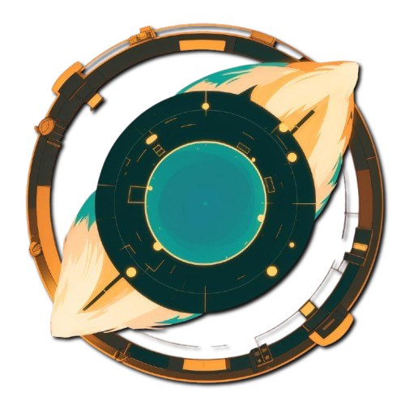

# Teri-anric OR StrawBerry 

## Backend developer with 2 years of experience specializing in building applications using frameworks like Django/FastAPI. Experienced in creating integrations, APIs, and Telegram bots.

### If you are interested in my studies, there is a separate account for
<a href="https://github.com/teri-schools/">
    
    Teri-schools
</a>

### Check out the convenient web version:
[ Website](https://teri-anric.onrender.com/)

##  Technical Stack

###  Programming Languages

    
    
    
    

###  Frameworks & Libraries

    
    
    
    
    
    

###  Databases

    
    
    
    

###  Tools & Technologies

    
    
    
    
    

###  Frontend

    
    
    
    
    

###  AI Experience

    
    

### Connect me:

    
    
    
    

